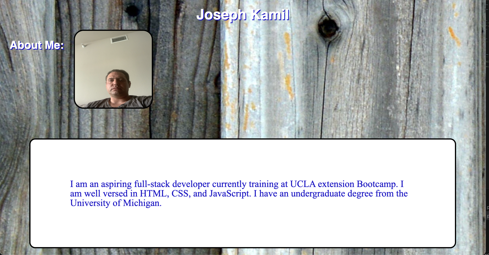

# Portfolio

## Description

You will create a web application from scratch! by build a portfolio page, which you can add to as the course progresses. A portfolio of work can showcase your skills and talents to employers and is an effective portfolio highlights your strongest work as well as the thought processes behind it.

## Installation

N/A

## Usage

https://github.com/kamilj62/portfolio

To use this Horiseon Webpage, you can review the notes in each section. For suggestions on what to study first, open the Chrome DevTools by pressing Command+Option+I (macOS) or Control+Shift+I (Windows). A console panel should open either below or to the side of the webpage in the browser. There you will see a list of topics we learned from the prework along with a suggestion on which topic to study first.

font swesome 

## Credits

N/A

## License

Please refer to the LICENSE in the repo.
